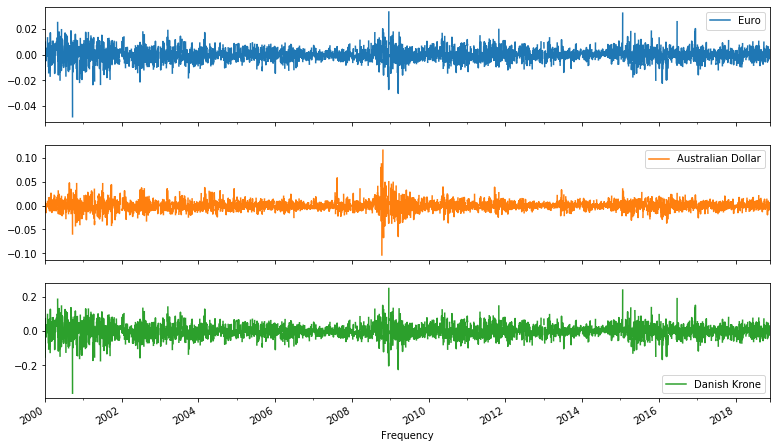
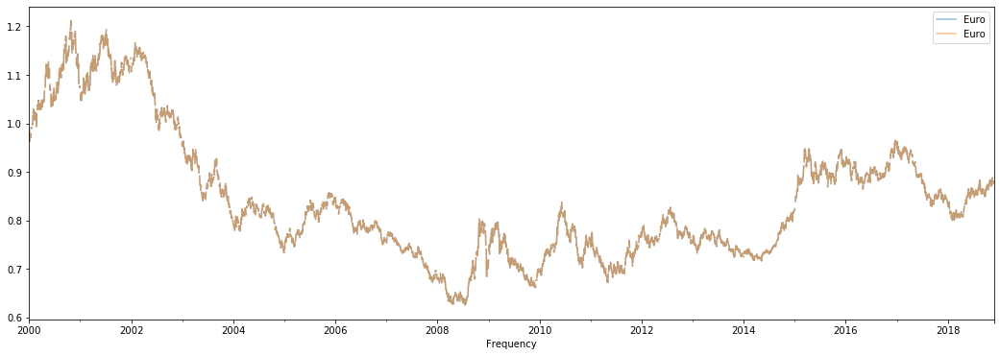
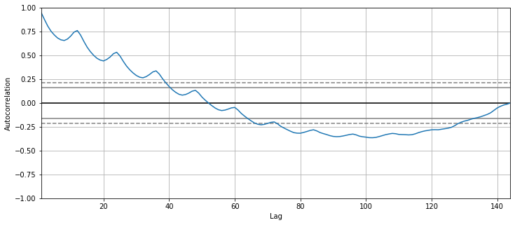
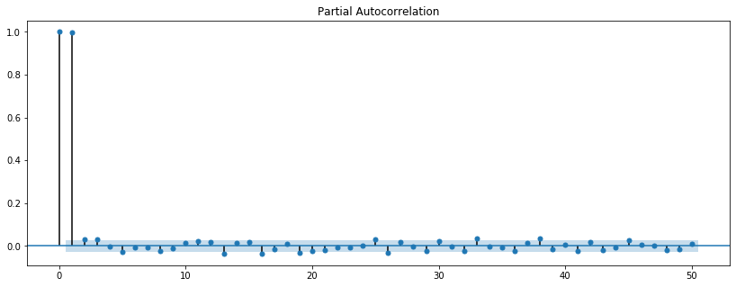
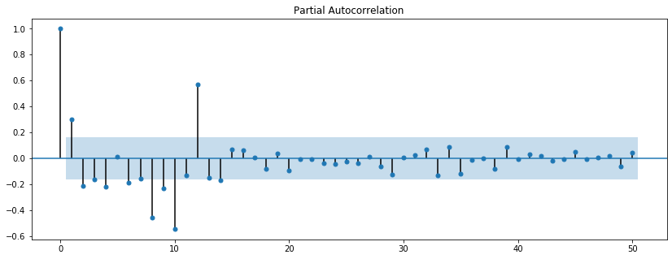

# Correlation and Autocorrelation in Time Series - Lab

## Introduction

In this lab, you'll practice your knowledge of correlation, autocorrelation, and partial autocorrelation by working on three different datasets. 

## Objectives

In this lab you will: 

- Plot and discuss the autocorrelation function (ACF) for a time series 
- Plot and discuss the partial autocorrelation function (PACF) for a time series 

## The Exchange Rate Data

We'll be looking at the exchange rates dataset again. 

- First, run the following cell to import all the libraries and the functions required for this lab 
- Then import the data in `'exch_rates.csv'` 
- Change the data type of the `'Frequency'` column 
- Set the `'Frequency'` column as the index of the DataFrame 


```python
# Import all packages and functions
import pandas as pd
import numpy as np
import matplotlib.pylab as plt
%matplotlib inline
from statsmodels.graphics.tsaplots import plot_acf, plot_pacf
from matplotlib.pylab import rcParams
```


```python
# __SOLUTION__ 
# Import all packages and functions
import pandas as pd
import numpy as np
import matplotlib.pylab as plt
%matplotlib inline
from statsmodels.graphics.tsaplots import plot_acf, plot_pacf
from matplotlib.pylab import rcParams
```


```python
# Import data
xr = None

# Change the data type of the 'Frequency' column 


# Set the 'Frequency' column as the index

```


```python
# __SOLUTION__ 
# Import data
xr = pd.read_csv('exch_rates.csv')

# Change the data type of the 'Frequency' column 
xr['Frequency'] = pd.to_datetime(xr['Frequency'])

# Set the 'Frequency' column as the index
xr.set_index('Frequency', inplace=True)
```

Plot all three exchange rates in one graph: 


```python
# Plot here

```


```python
# __SOLUTION__ 
# Plot here
xr.plot(figsize=(18,6))
plt.xlabel('Year', fontsize=14);
```


You can see that the EUR/USD and AUD/USD exchange rates are somewhere between 0.5 and 2, whereas the Danish Krone is somewhere between 4.5 and 9. Now let's look at the correlations between these time series. 


```python
# Correlation
```


```python
# __SOLUTION__ 
# Correlation
xr.corr()
```


<div>
<style scoped>
    .dataframe tbody tr th:only-of-type {
        vertical-align: middle;
    }

    .dataframe tbody tr th {
        vertical-align: top;
    }

    .dataframe thead th {
        text-align: right;
    }
</style>
<table border="1" class="dataframe">
  <thead>
    <tr style="text-align: right;">
      <th></th>
      <th>Euro</th>
      <th>Australian Dollar</th>
      <th>Danish Krone</th>
    </tr>
  </thead>
  <tbody>
    <tr>
      <th>Euro</th>
      <td>1.000000</td>
      <td>0.883181</td>
      <td>0.999952</td>
    </tr>
    <tr>
      <th>Australian Dollar</th>
      <td>0.883181</td>
      <td>1.000000</td>
      <td>0.882513</td>
    </tr>
    <tr>
      <th>Danish Krone</th>
      <td>0.999952</td>
      <td>0.882513</td>
      <td>1.000000</td>
    </tr>
  </tbody>
</table>
</div>


### What is your conclusion here? You might want to use outside resources to understand what's going on.


```python

```


```python
# __SOLUTION__
# The exchange rates for Euro and the Australian dollar are highly correlated, 
# but there are differences. The Euro and the Danish Krone, however, is perfectly correlated. 
# If you do further research you'll notice that the Danish Krone is pegged to the Euro, 
# which means that they are basically designed to perfectly correlate together! 
# The fact that the value is just very, very close to 1 is due to rounding errors. 
# Usually when the correlation is so close to 1 (or -1), it's too good to be true. 
# So make sure you always dig deeper to correctly understand and interpret these numbers.  
```

Next, look at the plots of the differenced (1-lag) series. Use subplots to plot them rather than creating just one plot. 


```python
# 1-lag differenced series 
xr_diff = None
```


```python
# __SOLUTION__ 
# 1-lag differenced series 
xr_diff = xr.diff(periods=1)
```


```python
# Plot

```


```python
# __SOLUTION__ 
# Plot
xr_diff.plot(figsize=(13,8), subplots=True, legend=True);
```





Calculate the correlation of this differenced time series. 


```python
# Correlation 

```


```python
# __SOLUTION__ 
# Correlation 
xr_diff.corr()
```


<div>
<style scoped>
    .dataframe tbody tr th:only-of-type {
        vertical-align: middle;
    }

    .dataframe tbody tr th {
        vertical-align: top;
    }

    .dataframe thead th {
        text-align: right;
    }
</style>
<table border="1" class="dataframe">
  <thead>
    <tr style="text-align: right;">
      <th></th>
      <th>Euro</th>
      <th>Australian Dollar</th>
      <th>Danish Krone</th>
    </tr>
  </thead>
  <tbody>
    <tr>
      <th>Euro</th>
      <td>1.000000</td>
      <td>0.545369</td>
      <td>0.999667</td>
    </tr>
    <tr>
      <th>Australian Dollar</th>
      <td>0.545369</td>
      <td>1.000000</td>
      <td>0.545133</td>
    </tr>
    <tr>
      <th>Danish Krone</th>
      <td>0.999667</td>
      <td>0.545133</td>
      <td>1.000000</td>
    </tr>
  </tbody>
</table>
</div>


### Explain what's going on


```python

```


```python
# __SOLUTION__
# Differencing the series here led to a decrease 
# in correlation between the EUR/USD and AUD/USD series. 
# If you think a little further, this makes sense: in the previous lesson, 
# the high correlation was a result of seasonality. 
# Differencing led to an increase in correlation between series, 
# here the series are moving in (more or less) the same direction 
# on a day-to-day basis and seasonality is not present, hence this result.
```

Next, let's look at the "lag-1 autocorrelation" for the EUR/USD exchange rate. 

- Create a "lag-1 autocorrelation" series 
- Combine both the original and the shifted ("lag-1 autocorrelation") series into a DataFrame 
- Plot these time series, and look at the correlation coefficient 


```python
# Isolate the EUR/USD exchange rate
eur = xr[['Euro']]

# "Shift" the time series by one period
eur_shift_1 = None
```


```python
# __SOLUTION__ 
# Isolate the EUR/USD exchange rate
eur = xr[['Euro']]

# "Shift" the time series by one period
eur_shift_1 = eur.shift(periods=1)
```


```python
# Combine the original and shifted time series
lag_1 = None

# Plot 

```


```python
# __SOLUTION__ 
# Combine the original and shifted time series
lag_1 = pd.concat([eur_shift_1, eur], axis=1)

# Plot
lag_1.plot(figsize=(18,6), alpha=0.5);
```





```python
# Correlation

```


```python
# __SOLUTION__ 
# Correlation
lag_1.corr()
```


<div>
<style scoped>
    .dataframe tbody tr th:only-of-type {
        vertical-align: middle;
    }

    .dataframe tbody tr th {
        vertical-align: top;
    }

    .dataframe thead th {
        text-align: right;
    }
</style>
<table border="1" class="dataframe">
  <thead>
    <tr style="text-align: right;">
      <th></th>
      <th>Euro</th>
      <th>Euro</th>
    </tr>
  </thead>
  <tbody>
    <tr>
      <th>Euro</th>
      <td>1.000000</td>
      <td>0.999146</td>
    </tr>
    <tr>
      <th>Euro</th>
      <td>0.999146</td>
      <td>1.000000</td>
    </tr>
  </tbody>
</table>
</div>


Repeat this for a "lag-50 autocorrelation". 


```python
# "Shift" the time series by 50 periods
eur_shift_50 = None

# Combine the original and shifted time series
lag_50 = None

# Plot

```


```python
# __SOLUTION__ 
# "Shift" the time series by 50 periods
eur_shift_50 = eur.shift(periods=50)

# Combine the original and shifted time series
lag_50 = pd.concat([eur_shift_50, eur], axis=1)

# Plot
lag_50.plot(figsize=(18,6), alpha=0.8);
```





```python
# Correlation

```


```python
# __SOLUTION__ 
# Correlation
lag_50.corr()
```


<div>
<style scoped>
    .dataframe tbody tr th:only-of-type {
        vertical-align: middle;
    }

    .dataframe tbody tr th {
        vertical-align: top;
    }

    .dataframe thead th {
        text-align: right;
    }
</style>
<table border="1" class="dataframe">
  <thead>
    <tr style="text-align: right;">
      <th></th>
      <th>Euro</th>
      <th>Euro</th>
    </tr>
  </thead>
  <tbody>
    <tr>
      <th>Euro</th>
      <td>1.000000</td>
      <td>0.968321</td>
    </tr>
    <tr>
      <th>Euro</th>
      <td>0.968321</td>
      <td>1.000000</td>
    </tr>
  </tbody>
</table>
</div>


### What's your conclusion here?


```python

```


```python
# __SOLUTION__
# Autocorrelation is very high in these time series, even up to a lag as big as 50! 
# This is no big surprise though: remember that these are random walk series, 
# which are highly recursive, as each value depends heavily on the previous one!
```

Knowing this, let's plot the ACF now.


```python
# Plot ACF

```


```python
# __SOLUTION__ 
# Plot ACF
plt.figure(figsize=(12,5))
pd.plotting.autocorrelation_plot(eur.dropna());
```


The series is heavily autocorrelated at first, and then there is a decay. This is a typical result for a series that is a random walk, generally you'll see heavy autocorrelations first, slowly tailing off until there is no autocorrelation anymore.

Next, let's look at the partial autocorrelation function plot.


```python
# Plot PACF

```


```python
# __SOLUTION__ 
# Plot PACF
rcParams['figure.figsize'] = 14, 5
plot_pacf(eur.dropna(), lags=100);
```





This is interesting! Remember that *Partial Autocorrelation Function* gives the partial correlation of a time series with its own lagged values, controlling for the values of the time series at all shorter lags. When controlling for 1 period, the PACF is only very high for one-period lags, and basically 0 for shorter lags. This is again a typical result for random walk series!

## The Airpassenger Data

Let's work with the air passenger dataset you have seen before. Plot the ACF and PACF for both the differenced and regular series. 

> Note: When plotting the PACF, make sure you specify `method='ywm'` in order to avoid any warnings. 


```python
# Import and process the air passenger data
air = pd.read_csv('passengers.csv')
air['Month'] = pd.to_datetime(air['Month'])
air.set_index('Month', inplace=True)
air.head()
```


```python
# __SOLUTION__ 
# Import and process the air passenger data
air = pd.read_csv('passengers.csv')
air['Month'] = pd.to_datetime(air['Month'])
air.set_index('Month', inplace=True)
air.head()
```


<div>
<style scoped>
    .dataframe tbody tr th:only-of-type {
        vertical-align: middle;
    }

    .dataframe tbody tr th {
        vertical-align: top;
    }

    .dataframe thead th {
        text-align: right;
    }
</style>
<table border="1" class="dataframe">
  <thead>
    <tr style="text-align: right;">
      <th></th>
      <th>#Passengers</th>
    </tr>
    <tr>
      <th>Month</th>
      <th></th>
    </tr>
  </thead>
  <tbody>
    <tr>
      <th>1949-01-01</th>
      <td>112</td>
    </tr>
    <tr>
      <th>1949-02-01</th>
      <td>118</td>
    </tr>
    <tr>
      <th>1949-03-01</th>
      <td>132</td>
    </tr>
    <tr>
      <th>1949-04-01</th>
      <td>129</td>
    </tr>
    <tr>
      <th>1949-05-01</th>
      <td>121</td>
    </tr>
  </tbody>
</table>
</div>


```python
# Plot ACF (regular)

```


```python
# __SOLUTION__ 
# Plot ACF (regular)
plt.figure(figsize=(12,5))
pd.plotting.autocorrelation_plot(air);
```


```python
# Plot PACF (regular)

```


```python
# __SOLUTION__ 
# Plot PACF (regular)
rcParams['figure.figsize'] = 14, 5
plot_pacf(air.dropna(), lags=100, method='ywm');
```


```python
# Generate a differenced series
air_diff = None
```


```python
# __SOLUTION__ 
# Generate a differenced series
air_diff = air.diff(periods=1)
```


```python
# Plot ACF (differenced)


```


```python
# __SOLUTION__ 
# Plot ACF (differenced)
plt.figure(figsize=(12,5))
pd.plotting.autocorrelation_plot(air_diff.dropna());
```


```python
# Plot PACF (differenced)

```


```python
# __SOLUTION__ 
# Plot PACF (differenced)
rcParams['figure.figsize'] = 14, 5
plot_pacf(air_diff.dropna(), lags=100, method='ywm');
```





### Your conclusion here


```python

```


```python
# __SOLUTION__
# The result reminds us a lot of the google trends data. 
# The seasonality is much more clear in the differenced time series. 
# The PACF has just one very strong correlation, right at 12 months.
```

## The NYSE data

Are you getting the hang of interpreting ACF and PACF plots? For one final time, plot the ACF and PACF for both the NYSE time series. 

> Note: When plotting the PACF, make sure you specify `method='ywm'` in order to avoid any warnings. 


```python
# Import and process the NYSE data
nyse = pd.read_csv('NYSE_monthly.csv') 
nyse['Month'] = pd.to_datetime(nyse['Month'])
nyse.set_index('Month', inplace=True)
nyse.head()
```


```python
# __SOLUTION__ 
# Import and process the NYSE data
nyse = pd.read_csv('NYSE_monthly.csv') 
nyse['Month'] = pd.to_datetime(nyse['Month'])
nyse.set_index('Month', inplace=True)
nyse.head()
```


<div>
<style scoped>
    .dataframe tbody tr th:only-of-type {
        vertical-align: middle;
    }

    .dataframe tbody tr th {
        vertical-align: top;
    }

    .dataframe thead th {
        text-align: right;
    }
</style>
<table border="1" class="dataframe">
  <thead>
    <tr style="text-align: right;">
      <th></th>
      <th>monthly_return</th>
    </tr>
    <tr>
      <th>Month</th>
      <th></th>
    </tr>
  </thead>
  <tbody>
    <tr>
      <th>1961-01-01</th>
      <td>0.082</td>
    </tr>
    <tr>
      <th>1961-02-01</th>
      <td>0.059</td>
    </tr>
    <tr>
      <th>1961-03-01</th>
      <td>0.050</td>
    </tr>
    <tr>
      <th>1961-04-01</th>
      <td>0.008</td>
    </tr>
    <tr>
      <th>1961-05-01</th>
      <td>0.042</td>
    </tr>
  </tbody>
</table>
</div>


```python
# Plot ACF
```


```python
# __SOLUTION__ 
plt.figure(figsize=(12,5))
pd.plotting.autocorrelation_plot(nyse.dropna());
```


```python
# Plot PACF
```


```python
# __SOLUTION__ 
rcParams['figure.figsize'] = 14, 5
plot_pacf(nyse, lags=100, method='ywm');
```


## Your conclusion here


```python

```


```python
# __SOLUTION__
# Autocorrelations and partial autocorrelations are virtually 0 for any lag. 
# This is no surprise! The NYSE series was a white noise series, meaning there is no trend or no seasonality! 
# This is, again, a typical result for these kind of series.

```


## Summary

Great, you've now been introduced to ACF and PACF. Let's move into more serious modeling with autoregressive and moving average models!
